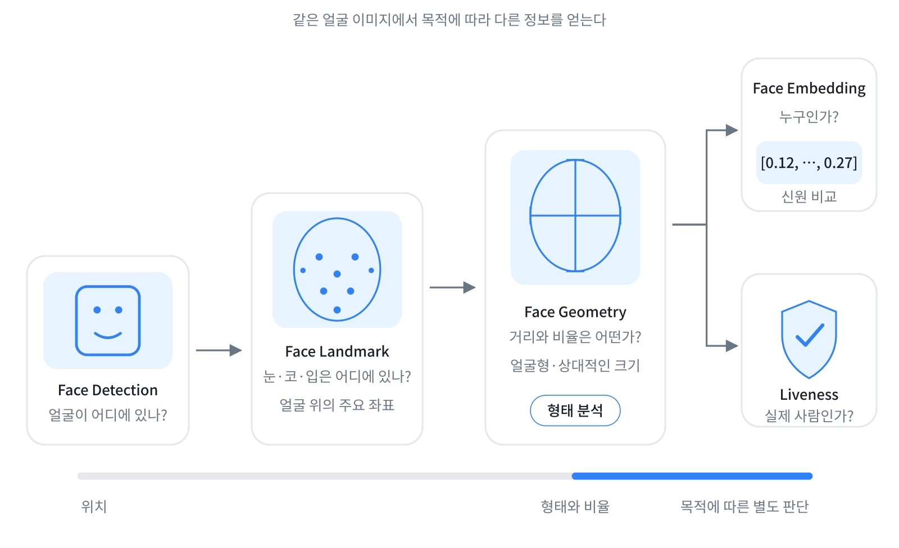

# 얼굴 인식 기술

## 출발점

- 얼굴을 스캔한 후 어울리는 안경을 추천하는 서비스
- 필요했던 정보: 얼굴형 추측
  - 얼굴 너비
  - 두 눈의 간격
  - 미간 거리
- Face Landmark 기술을 구현한 **MediaPipe Face Landmarker**를 사용
  - 카메라가 얼굴을 인식하면 눈꼬리, 코끝, 입술, 턱선처럼 얼굴의 주요 위치에 가상의 점을 찍어준다.
  - 눈·코·입·윤곽의 좌표를 얻는다.

```text
    • 이마

• 눈             눈 •
        • 코끝

        • 입술
        • 턱
```

각 점은 보통 다음과 같은 좌표를 가진다.

```js
{
  x: 0.42, // 가로 위치
  y: 0.31, // 세로 위치
  z: -0.08 // 얼굴 표면의 상대적인 깊이
}
```

## 실제 얼굴 크기는 왜 알기 어려웠을까?

- MediaPipe의 `x`, `y` 좌표는 이미지 안에서의 상대적인 위치다.
  - `x: 0.4`는 이미지 너비의 40% 지점이라는 의미다.
  - 밀리미터 단위의 실제 길이가 아니다.
- 따라서 랜드마크 사이의 거리로 알 수 있는 것은 **비율**이다.
  - 얼굴 너비와 길이의 비율
  - 눈 사이 거리와 얼굴 너비의 비율
  - 얼굴형을 구분하는 상대적인 특징
- 단안 카메라에는 실제 크기를 결정할 **절대 스케일**이 없다.
  - 작은 얼굴이 카메라 가까이에 있는 경우
  - 큰 얼굴이 카메라 멀리 있는 경우
  - 두 얼굴이 화면에서 같은 크기로 보이면 좌표만으로 구분하기 어렵다.

## Face Geometry를 사용했다면 해결됐을까?

- Face Geometry를 함께 사용하면 랜드마크를 표준 3D 얼굴 모델에 맞춰 정렬할 수 있다.
  - 얼굴의 회전과 기울기 추정
  - 랜드마크 사이의 3D 관계 표현
- Face Geometry의 cm 단위는 표준 얼굴 모델인 **Canonical Face Model**을 기준으로 정의된다.
  - 사용자의 얼굴을 실제 자로 측정해서 얻은 값은 아니다.
  - 카메라 파라미터와 표준 얼굴 모델의 크기에 영향을 받는다.
- 따라서 자세 보정과 AR 배치에는 유용하지만, 사용자의 실제 얼굴 폭을 정확한 mm 단위로 측정하는 용도로는 한계가 있다.

## 실제 크기를 얻기 위해 고려할 수 있는 방법

- **홍채 지름을 기준자로 사용**
  - 얼굴 폭과 홍채 폭의 픽셀 비율을 이용해 실제 크기를 추정한다.
  - 별도의 기준 물체가 필요 없지만 개인차와 촬영 오차가 존재한다.
- **기준 물체 사용**
  - 신용카드처럼 실제 크기를 아는 물체를 얼굴과 함께 촬영한다.
  - 비교적 단순하지만 사용자 경험이 불편해진다.
- **촬영 환경 고정**
  - 카메라 기종, 촬영 거리와 위치를 고정해 스케일을 추정한다.
  - 매장 단말기처럼 통제된 환경에 적합하다.
- **깊이 센서 사용**
  - TrueDepth와 같은 센서로 얼굴과 카메라 사이의 거리를 측정한다.
  - 일반 웹캠이나 모든 기기에서 사용할 수 없다.

## 얼굴 정보와 기술

- 안경 추천에서 필요했던 정보
  - 얼굴의 크기와 형태는 어떠한가?
- 페이스페이에서 필요한 정보
  - 등록된 사용자 중 누구인가?
  - 카메라 앞에 실제 사람이 있는가?

> 같은 얼굴을 촬영하더라도 서비스가 해결하려는 문제에 따라 필요한 얼굴 정보와 기술은 달라진다.

## ‘얼굴 정보’는 하나가 아니다



- **Face Detection**
  - 이미지에서 얼굴의 위치를 찾는다.
  - 촬영 가이드와 얼굴 영역 추출에 사용한다.
- **Face Landmark**
  - 눈·코·입·얼굴 윤곽의 좌표를 찾는다.
  - 얼굴형 분석, 표정 인식, AR 필터에 사용한다.
- **Face Geometry**
  - 얼굴의 3D 형태와 자세를 추정한다.
  - 얼굴 비율 분석, 자세 보정과 AR 객체 배치에 사용한다.
  - 실제 얼굴 크기를 정확한 mm 단위로 직접 측정하는 기술은 아니다.
- **Face Embedding**
  - 사람을 구별하는 특징을 숫자 벡터로 표현한다.
  - 얼굴 검증과 식별에 사용한다.
- **Liveness Detection**
  - 카메라 앞에 실제 사람이 있는지 판단한다.
  - 사진과 영상 등을 이용한 위조를 막는다.

> Face Landmark처럼 브라우저에서 바로 실행하기 쉬운 기술도 있고, 서버나 상용 SDK가 필요한 기술도 있다.

## 페이스페이는 얼굴로 신원을 구별한다

- 페이스페이에 필요한 정보는 등록된 사용자 중 누구인지다.
- 현대 얼굴 인식 시스템은 일반적으로 얼굴 이미지를 **Face Embedding**으로 변환한다.
- Face Embedding
  - 얼굴 특징을 표현한 숫자 벡터
  - 컴퓨터가 얼굴끼리 비교하기 위한 표현
  - 얼굴 특징을 압축한 ‘숫자 지문’으로 이해할 수 있다.

```text
A의 사진 1 → [0.12, -0.42, 0.81, ..., 0.27]
A의 사진 2 → [0.10, -0.39, 0.79, ..., 0.25]
B의 사진   → [0.73,  0.15, -0.31, ..., 0.62]
```

- 각 숫자가 코의 크기처럼 하나의 명확한 의미를 갖는 것은 아니다.
- 모델이 사람을 구별하는 데 유용한 특징을 조합해 만든 값이다.
- 표정·조명·각도 변화는 신원 판단에 비교적 적은 영향을 주도록 학습한다.
- 같은 사람의 얼굴은 벡터 사이의 거리가 가깝도록 학습한다.
- 다른 사람의 얼굴은 벡터 사이의 거리가 멀어지도록 학습한다.

## 얼굴이 닮았다는 결과만으로 결제할 수는 없다

- 얼굴 인식 모델
  - 두 얼굴의 유사도를 계산한다.
  - 기준값을 이용해 같은 사람인지 판단한다.
- 대표적인 오류
  - **False Acceptance**: 다른 사람을 본인으로 잘못 승인
  - **False Rejection**: 본인을 다른 사람으로 잘못 거절
- 고려해야 하는 공격
  - 인쇄된 얼굴 사진
  - 휴대전화에서 재생한 영상
  - 고화질 화면
  - 얼굴 모형

### 페이스페이의 다층 보안

```text
얼굴 인식
   +
라이브니스
   +
이상거래탐지시스템(FDS)
   +
필요한 경우 추가 인증
   ↓
결제 판단
```

- **Facial Recognition Model**: 등록된 얼굴과 비교
- **Liveness**: 실제 사람인지 확인
- **FDS**: 평소와 다른 기기·시간대·거래 패턴 등 비정상적인 거래 패턴 탐지
- **2차 인증**: 쌍둥이처럼 매우 유사한 얼굴 등에 대응
- **암호화**: 등록된 생체정보 보호

## Liveness Detection

확인하려는 것은 **지금 카메라 앞에 실제 사람이 있는가?**이다.

### Active Liveness

- 사용자에게 특정 행동을 요구한다.
  - 눈 깜빡이기
  - 고개 돌리기
  - 화면의 지시에 따라 움직이기
- 장점
  - 명시적인 생체 반응을 확인할 수 있다.
- 단점
  - 결제 흐름이 느려질 수 있다.

### Passive Liveness

- 별도의 행동 없이 카메라 신호를 분석한다.
  - 피부의 질감
  - 화면이나 인쇄물의 반사
  - 여러 프레임 사이의 변화
  - 깊이 정보
- 장점
  - 사용자가 자연스럽게 카메라만 바라보면 된다.
- 단점
  - 다양한 촬영 환경과 공격 방식을 고려해야 한다.

## 프론트엔드의 입력 품질 역할

- 카메라 기반 서비스에서 발생하는 문제
  - 얼굴이 너무 가깝거나 멀다.
  - 고개가 기울어져 있다.
  - 역광이나 그림자가 생긴다.
  - 안경이나 모자가 얼굴 일부를 가린다.
  - 사용자가 안내 메시지를 읽지 않는다.
- 토스 단말기에서 발견한 문제
  - 사용자가 “더 가까이 와주세요”라는 문구를 읽지 않는다.
  - 화면 속 자신의 얼굴만 바라본다.
- 개선
  - 오류 메시지를 사용자의 얼굴 주변에 표시한다.

### 카메라 인터페이스의 역할

- 적절한 거리와 각도를 실시간으로 안내
- 잘못된 입력에 즉각적인 시각 피드백 제공
- 오류 원인을 이해할 수 있게 표현
- 인증 실패 시 다른 인증 수단 제공
- 모델에 전달되는 입력 품질을 일정하게 유지

## Ref

### 토스 공식 자료

- 바라보는 순간 끝나는 결제, 토스 페이스페이
- 얼굴 인식의 역사와 페이스페이의 미래
- 페이스페이 등록부터 결제까지 FAQ
- 페이스페이 보안 기술 소개
- 토스페이 연동 가이드 — 페이스페이 FAQ
- 왜 아무도 에러 메시지를 읽지 않을까?

### 비교 자료

- Google AI Edge — Face Landmarker
- Apple Platform Security — Face ID security
- GeekNews — 얼굴 인식을 피하기 위한 얼굴 변형 정도
- GeekNews — 절대 그들에게 당신의 얼굴을 주지 마라
